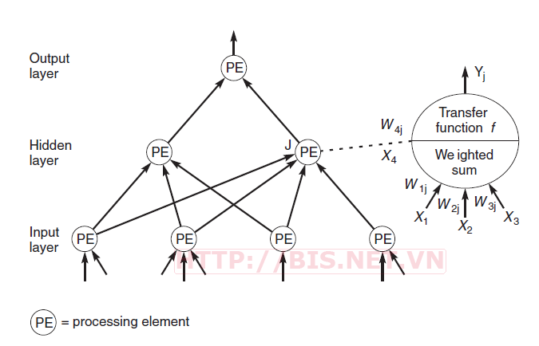
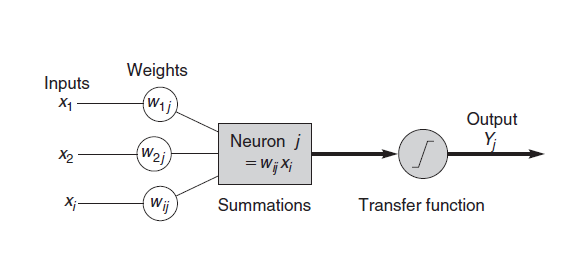
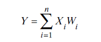
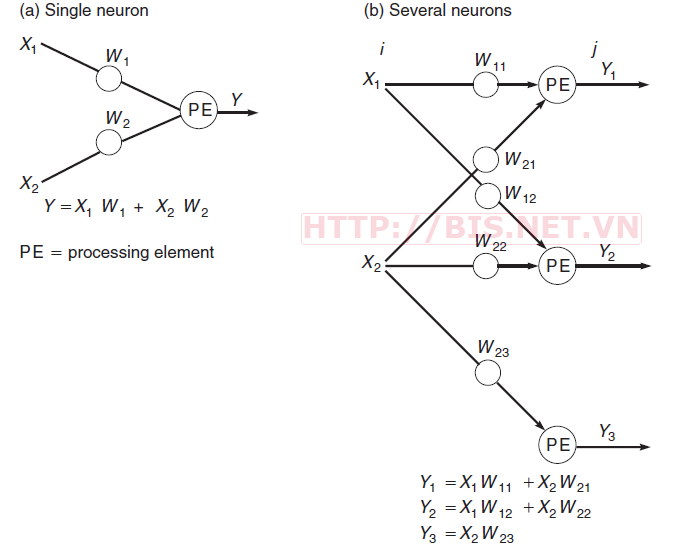
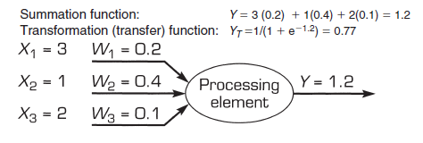
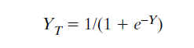

# Basic Artificial Neural Network

* Mạng Neuron nhân tạo (Artificial Neural Network- ANN) là mô hình xử lý thông tin được mô phỏng dựa trên hoạt động của hệ thống thần kinh của sinh vật, bao gồm số lượng lớn các Neuron được gắn kết để xử lý thông tin. ANN giống như bộ não con người, được học bởi kinh nghiệm (thông qua huấn luyện), có khả năng lưu giữ những kinh nghiệm hiểu biết (tri thức) và sử dụng những tri thức đó trong việc dự đoán các dữ liệu chưa biết (unseen data).

## Kiến trúc tổng quát của một ANN

* 
* Kiến trúc chung của một ANN gồm 3 thành phần đó là **Input Layer**, **Hidden Layer** và **Output Layer**
* Trong đó, lớp ẩn (Hidden Layer) gồm các Neuron, nhận dữ liệu input từ các Neuron ở lớp (Layer) trước đó và chuyển đổi các input này cho các lớp xử lý tiếp theo. Trong một ANN có thể có nhiều Hidden Layer.  
* **Processing Elements (PE):** Các PE của ANN gọi là Neuron, mỗi Neuron nhận các dữ liệu vào (Inputs) xử lý chúng và cho ra một kết quả (output) duy nhất. Kết quả xử lý của một Neuron có thể làm Input cho các Neuron khác 
* **Quá trình xử lý thông tin của một ANN**
    
    * **Inputs**: Mỗi Input tương ứng với 1 thuộc tính (_attribute_) của dữ liệu (_patterns_)
    * **Output**: Kết quả của một ANN là một giải pháp cho một vấn đề
    * **Connection Weights (Trọng số liên kết)**:Đây là thành phần rất quan trọng của một ANN, nó thể hiện mức độ quan trọng (độ mạnh) của dữ liệu đầu vào đối với quá trình xử lý thông tin (quá trình chuyển đổi dữ liệu từ Layer này sang layer khác). Quá trình học (_Learning Processing_) của ANN thực ra là quá trình điều chỉnh các trọng số (_Weight_) của các input data để có được kết quả mong muốn.
    * **Summation Function (Hàm tổng)**: Tính tổng trọng số của tất cả các input được đưa vào mỗi Neuron (phần tử xử lý PE). Hàm tổng của một Neuron đối với n input được tính theo công thức sau:  
        *   
        * Hàm tổng đối với nhiều Neurons trong cùng một Layer sẽ được tính như sau:
        * 
    * **Transfer Function (Hàm chuyển đổi)**: 
        * Hàm tổng (**Summation Function**) của một Neuron cho biết khả năng kích hoạt (**Activation**) của neuron đó còn gọi là kích hoạt bên trong (**internal activation**). Các Neuron này có thể sinh ra một output có hoặc không trong ANN (hay output của 1 Neuron có thể được chuyển đến layer tiếp trong mạng Neuron hoặc không). Mối quan hệ giữa **Internal Activation** và kết quả (**output**) được thể hiện bằng hàm chuyển đổi (**Transfer Function**).
        * 
        * Bên trên là một ví dụ về hàm **sigmoid function (logical activation)** -  một Transfer Function. Kết quả của Sigmoid Function thuộc khoảng [0,1] nên còn gọi là hàm chuẩn hóa (**Normalized Function**).
        * 
        * Kết quả xử lý tại các Neuron (**Output**) đôi khi rất lớn, vì vậy **transfer function** được sử dụng để xử lý output này trước khi chuyển đến layer tiếp theo
        * Đôi khi thay vì sử dụng Transfer Function người ta sử dụng giá trị ngưỡng (**Threshold value**) để kiểm soát các output của các neuron tại một layer nào đó trước khi chuyển các output này đến các Layer tiếp theo. Nếu output của một neuron nào đó nhỏ hơn **Threshold** thì nó sẻ không được chuyển đến Layer tiếp theo. 

## Quá trình học (Learning Processing) của ANN

* ANN được huấn luyện (Training) hay được học (Learning) theo 2 kỹ thuật cơ bản đó là học có giám sát (Supervised Learning) và học không giám sát (Unsupervised Learning).
* **Supervised learning**: Quá trình Training được lặp lại cho đến kết quả (output) của ANN đạt được giá trị mong muốn (Desired value) đã biết.
* **Unsupervised learning**: Không sử dụng tri thức bên ngoài trong quá trình học (Learning), nên còn gọi là tự tổ chức (Self – Organizing). Mạng Neuron điển hình được huấn luyện theo kiểu Unsupervised là Self – Organizing Map (SOM)

* **Nguyên tắc huấn luyện (Training protocols)**: 
    * Mạng Neuron có 3 cách huấn luyện chính đó là **batch training**, **stochastic training** và **on-line training**
    * Đối với **on-line training** thì các trọng số của mạng (**weights**) được cập nhật ngay lập tức sau khi một input pattern được đưa vào mạng. 
    * **Stochastic training** cũng giống như **on-line training** nhưng việc chọn các input patterns để đưa vào mạng từ training set được thực hiện ngẫu nhiên (random). _SGD (Stochastic Gradient Descent)_ là một ví dụ về **Stochastic training**.
    * **Batch training** thì tất cả các input patterns được đưa vào mạng cùng lúc và sau đó cập nhật các trọng số mạng đồng thời. Ưu điểm của **on-line training** là tiết kiệm bộ nhớ vì không cần lưu lại số lượng lớn các input patterns trong bộ nhớ.