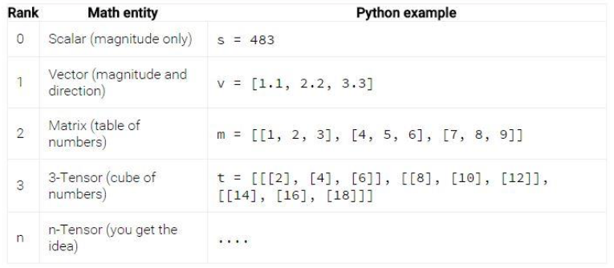
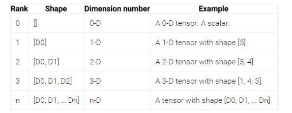

# Getting Started With TensorFlow

## Khái quát chung về TensorFlow

* TensorFlow biểu diễn các đại lượng tính toán dưới dạng đồ thị (**graph**). Trong đồ thị, các tham số được liên kết với nhau bởi các **Nodes**. Các Nodes gồm có các thành phần:
    * Operation (op - toán tử): biểu thị cho các đại lượng tính toán. 
    * Các input là các sensors và output cũng là các sensors
    * Các Tensors: tensor trong TensorFlow là các mảng nhiều chiều.
* Dưới đây, ta sẽ nói kĩ hơn về các thành phần có trong TensorFlow

### Tensors

* Tensors là thành phần biểu diễn dữ liệu trong TensorFlow, dữ liệu ta đưa vào tensors được thể hiện dưới dạng các vector, các ma trận. Các tensors được truyền qua các operation (nodes) trong đồ thị (flow)
* Cấu trúc dữ liệu của tensor là các mảng n chiều. 
    * Các khái niệm trong Tensor: Type, Rank, Shape
    * Rank (Hạng của tensor): là số chiều của mảng. Ví dụ như  
        
        * Rank 0 biểu thị các đại lượng vô hướng, Rank-1 tương ứng với các đại lượng vector
    * Shape trong tensor: đặc trưng cho số lượng các phần tử của mỗi chiều trong tensor
    
    * Type: kiểu dữ liệu của tensor, có thể là float, double, int64, int32, int16, string ...

### Graphs và Sessions

* TensorFlow sử dụng **dataflow graph** để đại diện cho mối quan hệ tính toán giữa các operations. Với các API ở được cung cấp ở mức thấp trong TensorFlow, điều đầu tiên bạn cần phải làm là định nghĩa ra một dataflow graph và tạo ra một session để chạy graph đó trên local (hoặc remote) devices.   
    
* Dataflow là một cách thức lập trình phổ biến trong tính toán song song. Trong dataflow graph, các `nodes` đại diện cho các khối tính toán, các `edges` đại diện cho data được đưa vào và trả lại trong các biểu thức tính toán. Ví dụ trong tensorFlow, `tf.matmul` operation (dùng để tính toán phép nhân ma trận) đại diện cho một node với 2 edges đầu vào là 2 ma trận và 1 edge đầu ra là 1 ma trận (tích của 2 ma trận đầu vào). 
* Sử dụng dataflow có những nhiều lợi ích khi bạn xây dựng hệ thống của mình, đó là: 
    * **Parallelism** (tính song song): bằng việc sử dụng các edges để thể hiện mối liên quan giữa các operations, hệ thống sẽ dễ dàng xác định được operations nào có thể được đưa vào tính toán song song. Tức là những operations không có mối liên hệ khăng khít vậy thì chúng có thể được tính toán đồng thời nhằm tăng hiệu năng. 
    * **Distributed execution** (xử lý phân tán): với việc sử dụng các edges đại diện cho các values được truyền (flow) như thế nào giữa các operations, vậy thì tensorFlow dựa vào đó để có thể xử lý data trên các operations khác nhau trên các thiết bị khác nhau (CPUs hoặc GPUs). 
    * **Compilation**: `XLA compiler` trong TensorFlow sử dụng các thông tin trong dataflow graph để xử lý code tối ưu hơn.
    * **Portability** (tính di động): Dataflow graph không phụ thuộc vào ngôn ngữ mà ta sử dụng. Ta có thể build nó trên Python, sau đó lưu trữ trong`SavedModel`, và có thể lấy lại ở trong một chương trình C++ nào đó. 

#### Graph

* Để xây dựng các graph, TensorFlow cung cấp một API có tên là `tf.Graph`, một tf.Graph sẽ mang 2 thông tin đó là: 
    * **Graph structure**: Các nodes và các edges trong graph mô tả cách thức các operations được sinh ra như thế nào chứ chúng không mô tả operations được sử dụng như thế nào. `Graph structure`, ta có thể thấy nó mang nhiều thông tin hữu ích, trực quan nhưng không phải toàn bộ thông tin được viết trong source code.
    * **Graph collections**: TensorFlow cung cấp một cách thức lưu trữ tập các metadata trong `tf.Graph`. Ví dụ như khi bạn tạo một `tf.Variable`, nó sẽ được đưa vào các collections mặc định là "global variables" và "trainable variables". Ngoài ra ta có thể tự tạo ra các collection với việc sử dụng hàm `tf.add_to_collection` và gọi ra một colllection để sử dụng bằng việc gọi hàm `tf.get_collection`. 
* Xây dựng một `tf.Graph`: Để xây dựng một graph, trước tiên bạn cần sử dụng các API để tạo ra các nodes (`tf.Operation`) và các edges (`tf.Tensor`), rồi đưa chúng vào `tf.Graph`. TensorFlow cung cấp một **default graph** cho bạn (đương nhiên bạn có thể tự xây dựng graph, thậm chí multiple graphs trong TensorFlow). Ví dụ:
    * Gọi `tf.matmul(x, y)` sẽ tạo một `tf.Operation` để thực hiện phép nhân ma trận của 2 `tf.Tensor` x và y, thêm chúng vào `default graph` và trả về `tf.Tensor` với kết quả là phép nhân của 2 ma trận. 

#### Sessions 

* Để có thể tính toán với **graph** người ta phải đưa nó vào trong các **Sessons**. Sessons có nhiệm vụ:
    * Đưa các đại lượng tính toán trong đồ thị (các Nodes) vào trong các thành phần xử lý (CPU, GPU) và cung cấp cách thức để thực hiện các đại lượng đó. 
    * Trả lại kết quả là các tensor, dưới dạng mảng nhiều chiều. 

### Saving and Restoring <a id="save-n-store"></a>

### Estimators API <a id="estimators"></a>

* Estimators là một API ở mức cao trong TensorFlow, cung cấp cho người dùng các chương trình được cài đặt theo các thuật toán của Machine Learning. Trình tự thao tác với Estimators có thể được gói gọn thành các bước sau đây:
    1. Training
    1. Evaluation
    1. Prediction
    1. Export for serving
* **Advantages of Estimators**: Lợi ích khi sử dụng Estimators đó là: 
    * Bạn có thể chạy một model xây dựng bằng Estimators trên một máy trạm hoặc trên một môi trường phân tán. Hay bạn cũng có thể chạy model đó trên CPU hoặc GPU mà không phải lo lắng về sự không tương thích hay phải mò vào code để chỉnh sửa lại. Tóm lại là nó có thể chạy trên đa môi trường.
    * Estimators vì nó là API được cung cấp ở mức cao nên đương nhiên sẽ giúp bạn tạo ra các models dễ dàng hơnn rất nhiều so với các API được cung cấp ở mức thấp trong TensorFlow.
    * Estimators sẽ giúp ta xây dựng các graphs, hay nói một cách khác, ta không phải tự xây dựng graph trước
    * Estimators cung cấp một cách thức training cho model từ việc như thế nào và khi nào cần phải:
        * Xây dựng một graph
        * Khởi tạo các variables
        * Bắt đầu hàng đợi (queues)
        * Kiểm soát các exceptions và recovery lỗi
        * Lưu các kết quả vào trong TensorBoard
    
* **Pre-made Estimators** 
    * Pre-made Estimators đưa ra cho bạn cách thức làm việc với API ở mức cao trong TensorFlow, tức là bạn sẽ không cần phải quan tâm nhiều đến các vấn đề như làm sao để xây dựng các _computational graph_ hay các _sessions_ vì Estimators sẽ giúp ta làm hết những việc đó. Đương nhiên bạn có thể lựa chọn việc làm việc với Pre-made Estimators được cung cấp bởi TensorFlow hoặc tự xây dựng các thành phần giống như bên trên là tùy thích. Nhưng nếu bạn chọn pre-made thì dưới đây là các bước đơn giản mà bạn sẽ phải tuân theo:
        1. **Write one or more dataset importing functions**: Bạn cần xây dựng các hàm importing dữ liệu trước. Chẳng hạn như, bạn sẽ tạo trước 1 function để import training set, và 1 function để import test set. Nhưng mỗi dataset đó cần trả về 2 objects là 
            * Một dictionary với các keys là tên các _feature column_ và giá trị là các _Tensors_ tương ứng với các feature data.
            * Một Tensor chứa 1 (hoặc nhiều) labels (nhãn)
            * Ví dụ: 
            ```tf
            def input_fn(dataset):
            ...  # manipulate dataset, extracting feature names and the label
            return feature_dict, label
        1. **Define the feature columns**: Định nghĩa ra các feature columns. Mỗi một _tf.feature_column_ định danh một _feature name_, _type_ và các _input pre-processing_. Ví dụ như hình bên dưới ta tạo 3 feature columns với 2 dòng đầu ta tạo tên và kiểu của nó (kiểu mặc định của numberic_column là _tf.float32_), với column cuối cùng ta đưa vào một _normalizer_fn_ có nhiệm vụ nhận input đầu vào là các Tensors và trả về một Tensor phù hợp. 
        ```tf
        # Define three numeric feature columns.
        population = tf.feature_column.numeric_column('population')
        crime_rate = tf.feature_column.numeric_column('crime_rate')
        median_education = tf.feature_column.numeric_column ('median_education',
                            normalizer_fn='lambda x: x - global_education_mean')
        ```
        1. **Instantiate the relevant pre-made Estimator**: Khởi tạo các  pre-made Estimator tương ứng. Ví dụ bên dưới ta khởi tạo một pre-made Estimator có tên là _LinearClassifier_
        ```tf 
        # Instantiate an estimator, passing the feature columns.
        estimator = tf.estimator.Estimator.LinearClassifier(
            feature_columns=[population, crime_rate, median_education],
            )
        ```
        1. **Call a training, evaluation, or inference method**: Và cuối cùng là bạn sẽ training, evaluating hay inferencing cho model của mình.
        ```tf
        # my_training_set is the function created in Step 1
        estimator.train(input_fn=my_training_set, steps=2000)
        ```
    * Qua các bước trên ta có thể thấy việc sử dụng pre-made Estimators là không hề khó khăn, nó sẽ giúp ta có được một cách nhìn tổng quan về cách thức một model được tạo ra và sử dụng nó trong TensorFlow là như thế nào. 
