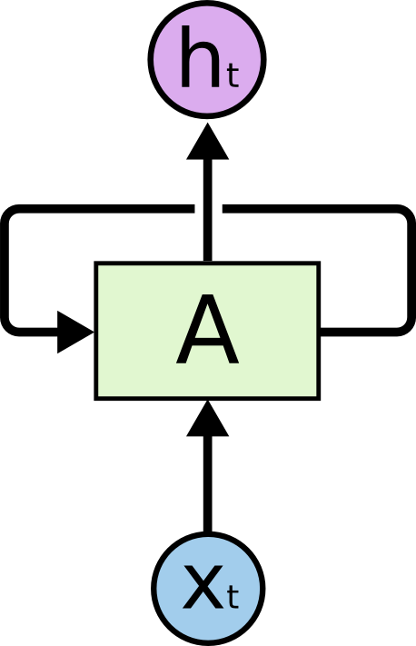

# Recurrent Neuron Network

## 1. Recurrent Neuron Network

* Ý tưởng chính của **RNN (Recurrent Neuron Network)** là sử dụng chuỗi các thông tin. Trong các mạng RNN truyền thống, các input và ouput cho ở mỗi 1 lần training là độc lập với nhau. Tức là chúng không thành chuỗi. Mô hình dạng này không còn phù hợp cho nhiều bài toán. Ví dụ như ta cần phải phân loại các sự kiện xảy ra trong 1 bộ phim theo trình tự. Mạng neuron truyền thống không thể làm được việc này vì nó không hề biết về sự kiện trước đó là gì để đưa ra quyết định cho sự kiện tiếp theo. 
* RNN sinh ra để giải quyết vấn đề đó. Mạng này sử dụng vòng lặp bên trong nó, cho phép thông tin có thể giữ lại được.  
    
* Hình trên mô tả một đoạn của mạng neuron hồi quy **A** với đầu vào là **xt **và đầu ra là **ht**. Một vòng lặp cho phép thông tin có thể được truyền từ bước này qua bước này qua bước khác của mạng neuron.

* Để dễ hiểu, ta có thể hình dung, mạng neuron hồi quy không có gì khác nhiều so với mạng neuron thuần. Chỉ có 1 sự khác biệt là nó gồm nhiều bản sao chép của cùng 1 mạng, trong đó đầu đầu ra của 1 mạng này là đầu vào của một mạng khác.  
    
* Chuỗi lặp lại các mạng này chính là phân giải của mạng nơ-ron hồi quy, các vòng lặp khiến chúng tạo thành một chuỗi danh sách các mạng sao chép nhau

* Trong vài năm gần đây RNN đã đưa ra được nhiều kết quả khả quan trong nhiều lĩnh vực: nspeech recognition, language modeling, translation, image captioning... Đặc biệt với sự thành công của **LSTM (Long Short Term Memory networks)**, là một mạng hồi quy đặc biệt, thực hiện được nhiều tác vụ và tốt hơn rất nhiều so với mạng hồi quy chuẩn. Hầu hết các kết quả khả quan thu được từ RNN là từ LSTM. Vậy tại sao lại là LSTM?

* Ý tưởng chính của RNN là kết nối các thông tin phía trước để dự đoán thời điểm hiện tại. Ví dụ như để dự đoán từ _"sky"_ trong câu _“the clouds are in the sky,”_, ta chỉ cần dựa vào thông tin trước đó là đủ. 

* Tuy nhiên trong tình huống ta phải dự đoán cho từ còn thiếu sau _"I grew up in France ... I speak fluent French."_. Thì nếu chỉ dựa vào nội dung _"I speak fluent French"_ hay _"I grew up in France"_ là chưa đủ, ta cần cả 2 để có thể suy luận ra từ cần điền. 
    
* Nhưng không may là với khoảng cách lớn dần thì RNN bắt đầu không nhớ và học được nữa. Về mặt lý thuyết, RNN có khả năng xử lý các phụ thuộc xa _Long-Term Dependencies_. Chúng ta có thể xem xét và cài đặt các tham số sao cho khéo là có thể giải quyết được vấn đề này. Tuy nhiên, trong thực tế RNN có vẻ không thể học được các tham số đó. Để giải quyết cho vấn đề này người ta đã đưa ra 1 giải pháp thay thế khác là LSTM. 

## 2. LSTM - Long Short Term Memory network

* LSTM là một mạng đặc biệt của RNN, nó có khả năng học được _Long-Term Dependencies_. Việc nhớ thông tin trong suốt thời gian dài là đặc tính mặc định của chúng, chứ ta không cần phải huấn luyện nó để có thể nhớ được. Giờ ta sẽ xem xét cấu trúc của mạng này. 

* Mọi mạng hồi quy đều có dạng là một chuỗi các module lặp đi lặp lại của mạng neuron. Với mạng RNN chuẩn, các module này có cấu trúc rất đơn giản, thường là một tầng **_[tanh](https://en.wikipedia.org/wiki/Hyperbolic_function)_**
    

* Và dưới đây là cấu trúc module của mạng LSTM. Thay vì chỉ có 1 tầng, chúng có tới 4 tầng tương tác với nhau.
    
* Để hiểu mạng trên ta cần làm quen với 1 số kí hiệu:
    
* Ở sơ đồ trên, mỗi một đường mang một vector từ đầu ra của một nút tới đầu vào của một nút khác. Các hình trong màu hồng biểu diễn các phép toán (ví dụ như phép cộng, nhân vector, tanh), còn các ô màu vàng được sử dụng để học trong các từng mạng neuron. Các đường hợp nhau kí hiệu việc kết hợp, còn các đường rẽ nhánh ám chỉ nội dung của nó được sao chép và chuyển tới các nơi khác nhau.

### 2.1 Ý tưởng cốt lõi của LSTM

* Chìa khóa của LSTM là trạng thái tế bào (_cell state_) - đường chạy nằm ngang phía bên trên hình vẽ. Nó chạy xuyên suốt tất cả các nút mạng và chỉ có 1 vài tương tác tuyến tính. Nhờ nó mà thôgn tin có thể truyền đi thông suốt. 
    

* LSTM có khả năng bỏ đi hoặc thêm vào các thông tin cần thiết cho trạng thái tế báo, chúng được điều chỉnh cẩn thận bởi các nhóm được gọi là cổng (**gate**). Các cổng là nơi sàng lọc thông tin đi qua nó, chúng được kết hợp bởi một tầng mạng [**sigmoid**](https://en.wikipedia.org/wiki/Sigmoid_function) và một **phép nhân vector**.   
    

* Tầng **sigmoid** cho đầu ra là 1 số trong khoảng **[0, 1]**, mô tả tỉ lệ thông tin được đi qua. Đầu ra là 0 thì không có thông tin nào đi qua cả. Đầu ra là 1 thì tất cả thông tin đều được đi qua.

* Một LSTM có 3 cổng giống như trên để duy trì trạng thái của tế bào. Cổng còn lại là cổng _tanh_ được xây dựng giống như ở mạng RNN thuần. 

### 2.2 Bên trong LSTM

* Bước 1: LSTM sẽ quyết định xem thông tin nào cần bỏ đi từ cell state. Quyết định này được đưa ra ở tầng **sigmoid**. Inputs của nó là ht-1 và xt, rồi đưa ra kết quả trong đoạn [0, 1] cho mỗi số trong cell state trước nó. 
    
    * Quay trở lại với ví dụ mô hình ngôn ngữ dự đoán từ tiếp theo dựa trên tất cả các từ trước đó, với những bài toán như vậy, thì cell state có thể sẽ mang thông tin về giới tính của một nhân vật nào đó giúp ta sử dụng được đại từ nhân xưng chuẩn xác. Tuy nhiên, khi đề cập tới một người khác thì ta sẽ không muốn nhớ tới giới tính của nhân vật nữa, vì nó không còn tác dụng gì với chủ thế mới này. 

* Bước 2: quyết định xem thông tin mới nào ta sẽ lưu vào cell state. Quyết định này gồm 2 giai đoạn: 1 là sử dụng một tầng **sigmoid** để quyết định giá trị nào sẽ được cập nhật, đồng thời là sử dụng một tầng **tanh** tạo ra một vector cho giá trị mới, nhằm thêm vào thông tin về trạng thái hiện tại. 2 là kết hợp 2 giá trị đó để tạo ra một cập nhật cho trạng thái. 
    
    * Chẳng hạn với ví dụ mô hình ngôn ngữ của ta, ta sẽ muốn thêm giới tính của nhân vật mới này vào cell state và thay thế giới tính của nhân vật trước đó.

* Bước 3: cập nhập cell state cũ **Ct-1** thành trạng thái mới **Ct**
    
    * Với bài toàn mô hình ngôn ngữ, chính là việc ta bỏ đi thông tin về giới tính của nhân vật cũ, và thêm thông tin về giới tính của nhân vật mới như ta đã quyết định ở các bước trước đó.

* Bước 4: ta cần quyết định xem ta muốn đầu ra là gì. Giá trị đầu ra sẽ dựa vào cell state, nhưng sẽ được tiếp tục sàng lọc. Đầu tiên, ta chạy một tầng sigmoid để quyết định phần nào của cell state ta muốn xuất ra. Sau đó, ta đưa nó trạng thái tế bảo qua một hàm tanh tanh để co giá trị nó về khoảng [-1, 1] [−1,1], và nhân nó với đầu ra của cổng **sigmoid** để được giá trị đầu ra ta mong muốn.
    
    * Với ví dụ về mô hình ngôn ngữ, chỉ cần xem chủ thể mà ta có thể đưa ra thông tin về một trạng từ đi sau đó. Ví dụ, nếu đầu ra của chủ thể là số ít hoặc số nhiều thì ta có thể biết được dạng của trạng từ đi theo sau nó phải như thế nào.