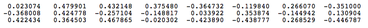

# Word2Vec

* Mô hình vector khoảng cách (Vector space model) được biết đến trong quá trình tìm kiếm thông tin, nơi mà mỗi một tài liệu được biểu diễn dưới dạng một vector. Các thành phần vector biểu diễn trọng số (weights) hoặc tầm quan trọng của mỗi một từ trong cả tài liệu. Sự giống nhau của 2 tài liệu được đo lường bằng phương pháp tích vô hướng của các vector khoảng cách ([**cosine similarity**](https://en.wikipedia.org/wiki/Cosine_similarity))
* _Word embedding_ là một ý tưởng được đưa ra nhằm biểu diễn các từ (words) dưới dạng các đại lượng vectors. Một trong số các cách tiếp cận đó là thuật toán _**Word2Vec**_ của _Tomáš Mikolov_, sử dụng một số lượng lớn văn bản để tạo ra các mảng nhiều chiều (50-300) đại diện cho tập các từ có trong văn bản và thể hiện được mối quan hệ giữa các từ mà không cần đến sự giúp đỡ của các yếu tố bên ngoài văn bản.

* **Word2Vec** models có một số mô hình truyền thống như _continuous bag-of-word (CBOW)_ và _skip-gram (SG)_ cũng như một số kĩ thuật cải tiến như _softmax_ và _negative sampling_. Trong phạm vi bài này, ta sẽ tìm hiểu về CBOW và SG. 

## 1. Continuous Bag-of-Word Model 

### 1.1 One-word context

* Chúng ta bắt đầu với mô hình đơn giản nhất của _continuous bag-of-word model (CBOW)_. Với mô hình này ta xét chỉ có 1 từ trong context word và model của ta cũng dự đoán với 1 target word.

* **Word2Vec** chỉ sử dụng một hidden layer. Bạn có thể xem hình minh họa bên dưới. Mô hình neurons trong các hidden layer đều là tuyến tính (linear). Trong hình vẽ ta giả sử rằng V là tập các từ mới có trong input layer và cũng là kích thước của input layer và N là một giá trị tùy ý được chọn và cũng là kích thước của hidden layer. Kích thước của output layer tương đương với input layer. Kết nối từ input layer tới hidden layer được biểu diễn bằng một ma trận _Wi kích thước VxN_ với mỗi hàng đại diện cho một từ mới trong input layer. Tương tự, với kết nối từ hidden layer tới output layer là một ma trân _Wo kích thước NxV_ với mỗi cột đại diện cho một từ trọng tập các từ mới. Giá trị input được đưa vào neuron netword là một _one-hot vector_ (hay được encode sử dụng _1-out of-V_). One-hot vector là vector chỉ có 1 thành phần nhận giá trị = 1 (ở đây chính là từ tương ứng), các giá trị còn lại đều nhận giá trị = 0.
      

* Để dễ hình dung hơn, ta sẽ lấy một ví dụ cụ thể. Giả sử tập training của ta gồm có 3 câu: _“the dog saw a cat”, “the dog chased the cat”, “the cat climbed a tree”_

* Số lượng các từ mới có mặt ở đây là 8 từ, được sắp theo thứ tự alphabet: _[a, cat, chased, climbed, dog, the, tree, saw]_. Do đó V của ta là 8 và cũng sẽ có 8 neurons trong output và input layer. Giả sử ta chọn số neurons trong hidden layer là N = 3. Vậy ma trận Wi và Wo lần lượt là 8x3 và 3x8. Trước khi training ta cần khởi tạo các giá trị ngẫu nhiên cho 2 ma trận. Giả sử ta khởi tạo được   
    Wi =   
      
    W0 =   
    

* Giả sử, mạng neuron cần học mối liên quan giữa từ "cat" ở input và "climbed" ở output. Trong thuật ngữ của _word embedding_, "cat" ở đây là _context word_ và "climbed" là _target word_. Trong trường hợp này input vector X là [0 1 0 0 0 0 0 0]t, chỉ có một vị trí = 1 là vị trí của từ "cat" trong tập các từ mới. Và target word là vector [0 0 0 1 0 0 0 0 ]t. 

* Với input vector X cho "cat", ta được output ở hidden layer là:   
    **Ht = XtWi = [-0.490796 -0.229903 0.065460]**
* Vector H chính là hàng thứ 2 trong ma trận Wi, lí do là bởi ta sử dụng one-hot vector để đại diện cho input đầu vào. Do đó, một cách đơn giản, ta có thể hình dung là đầu vào của input ở hidden layer có nhiệm vụ biến đổi vector X sang đầu ra của hidden layer. Tương tự, ta cũng sẽ có đầu ra của mạng neuron là:  
    **HtWo = [0.100934  -0.309331  -0.122361  -0.151399   0.143463  -0.051262  -0.079686   0.112928]**

* Mục đích của ta là cần học được mối liên quan của 2 từ, thông qua đánh giá xác suất _Pr(wordk|wordcontext) với k = 1,V_. Để đánh giá cho xác suất này Word2Vec biến đổi _activation values_ của output layer sang một giá trị khác sử dụng _softmax function_. Do đó, neuron thứ k trong output sẽ được đánh giá như sau:  
      
* Từ đây, ta có các đánh giá xác suất cho 8 từ trong văn bản là:   
    _0.143073   0.094925   0.114441   **0.111166**   0.149289   0.122874   0.119431   0.144800_
* Xác suất được in đậm lên đại diện cho target word "climbed". 
* Hàm lỗi được xác định bằng đạo hàm của xác suất p. Các trọng số trong Wi và Wo được cải thiện bằng cách sử dụng kĩ thuật lan truyền ngược _backpropagation_. Và quá trình training có thể tiếp tục đối với những cặp từ khác. 

* Về cơ bản, đó là cách **One-word context** làm việc. Dưới đây ta sẽ xem xét **Multi-word context** thì khác gì so với **One-word context**. 

### 1.2 Multi-word context

* Mô hình kiến trúc ta vừa đề cập đến được sử dụng để học mối liên hệ giữa các cặp từ. Trong _continuous bag of words model_, context có thể đại diện cho nhiều từ với 1 target word. Ví dụ ta có thể sử dụng "cat" và "tree" để làm context word cho target word là "climbed". Do đó, mạng neuron lúc này sẽ bị biến đổi, số kết nối của input layer tới hidden layer sẽ tăng lên C lần, với C là số lượng context words. Và để tính toán output cho hidden layer, CBOW lấy trung bình cộng của các vector     
    **Hk =  WTi * Xk với k=1,C** 
* Do đó H =   
    
* Chú ý rằng, các input layer trong CBOW chỉ sử dụng cùng một ma trận trọng  số Wi. Ta có thể xem hình bên dưới để hình dung
    
* Ta thấy rằng output layer không có gì thay đổi, nó giống hoàn toàn với **One-word context**

* Như vậy sự khác biệt giữa **One-word context** và **Multi-word context** chỉ là ở input đầu vào và cách tính output của hidden layer.

### 2. Skip-Gram Model

* **Skip-gram model** đảo ngược cách sử dụng target và context words so với **Multi-word context**. Tức là ta sẽ nhận 1 từ ở input layer, hidden layer vẫn không thay đổi, output layer sẽ được nhân lên C lần để chứa một số lượng các target words. Ví dụ như, context word là "climbed" ứng với vector [0 0 0 1 0 0 0 0 ]t, và 2 target word là "cat" và "tree", lần lượt ứng với [0 1 0 0 0 0 0 0]t và [0 0 0 0 0 0 0 1 ]t
* Hàm lỗi lúc này được tính bằng tổng của tất cả các hàm lỗi thành phần và được sử dụng để điều chỉnh ma trận trọng số Wo thông qua _backpropagation_. Điều này đảm bảo rằng ma trận trọng số Wo cho mỗi thành phần trong output layer là giống nhau trong khi training. 
